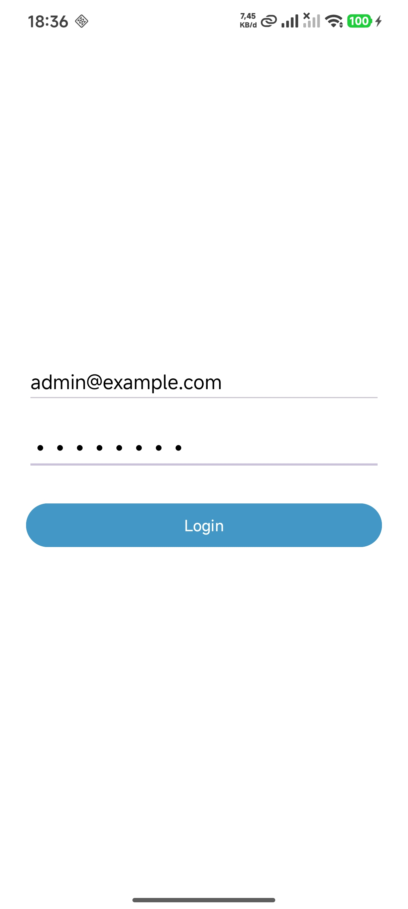
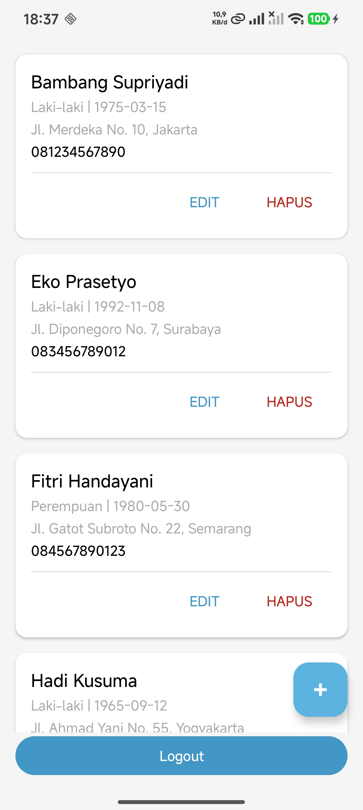
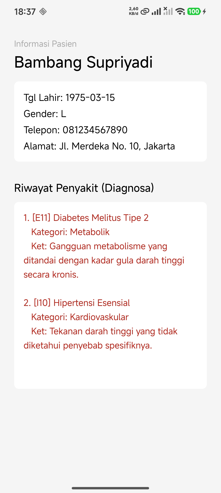
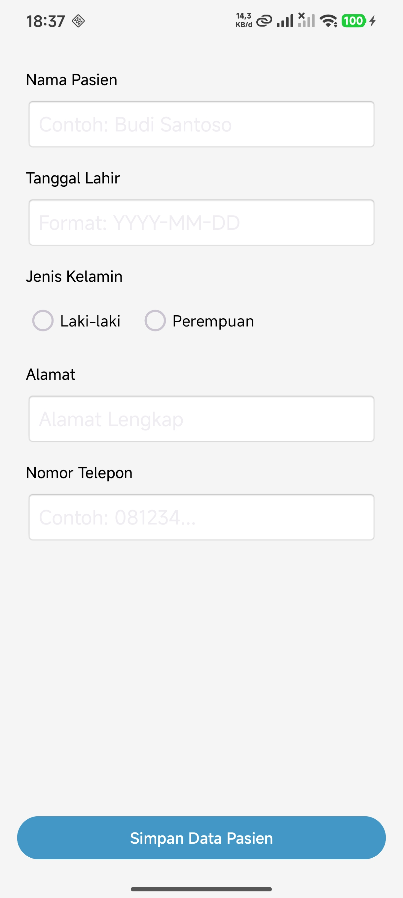

# Aplikasi Manajemen Pasien

Aplikasi Android berbasis Kotlin untuk mengelola data pasien menggunakan REST API. Proyek ini mencakup fitur autentikasi, daftar pasien dengan RecyclerView, detail pasien, serta formulir tambah dan edit data.

## 📸 Cuplikan Aplikasi (Screenshots)

Berikut adalah tampilan antarmuka dari aplikasi ini. Semua gambar tersimpan di dalam folder `screenshot/`.

| Halaman Login | Daftar Pasien | Detail Pasien | Form Tambah/Edit |
| :---: | :---: | :---: | :---: |
|  |  |  |  |

## 🛠️ Fitur Utama
- **Autentikasi**: Login pengguna untuk mengakses data medis secara aman.
- **Daftar Pasien**: Menampilkan informasi lengkap (Nama, Tanggal Lahir, Jenis Kelamin, Alamat, No Telepon) menggunakan `RecyclerView`.
- **Detail Pasien**: Menampilkan profil lengkap pasien beserta riwayat diagnosa penyakit.
- **Manajemen Data (CRUD)**: Menambah, mengubah, dan menghapus data pasien.
- **UI/UX Modern**: Layout yang rapi, mendukung perangkat dengan notch (`fitsSystemWindows`), dan desain yang konsisten.

## 🚀 Teknologi yang Digunakan
- **Bahasa**: Kotlin
- **Layout**: XML (ConstraintLayout, CardView, Material Components)
- **Library**: Retrofit/Volley untuk koneksi API, Lifecycle, dll.

## ⚙️ Cara Menjalankan Project
1. Clone repositori ini.
2. Buka project menggunakan **Android Studio**.
3. Pastikan folder `screenshot/` sudah berisi file `Login.png`, `Data.png`, `Detail.png`, dan `Form.png`.
4. Lakukan *Sync Project with Gradle Files*.
5. Jalankan aplikasi pada Emulator atau Device fisik.
